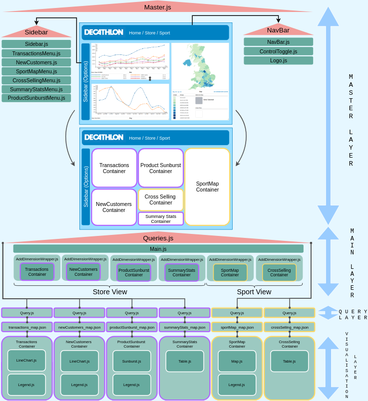

# **_PLAYBOOK_**<!-- omit in toc -->

## Contents<!-- omit in toc -->
- [Overview](#Overview)
- [Structure](#Structure)

## Overview

**tl;dr**:
Playbook is an interactive data visualisation app built using D3.js React, GraphQL and MongoDB. React Grid Layout was used for the panel system, and ReactFauxDom for the D3-React mash.

---

## Structure

The app will seem complicated, but is simplified with a basic understanding of React's (or other JavaScript frameworks like Angular or Vue) component hierarchy. A rough outline of the component hierarchy of this application can be found below:

